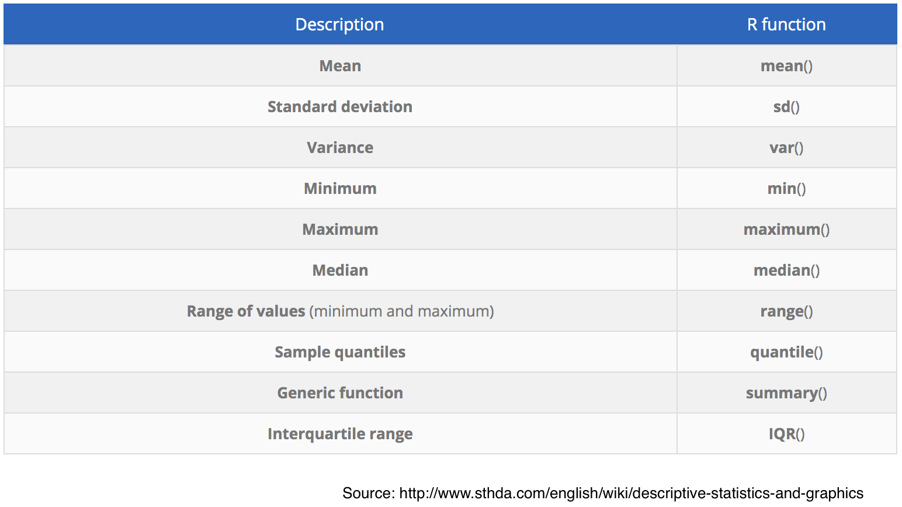

Visualization and Basic Statistical Analysis using R
========================================================
author: Jeho Park
date: Nov. 12, 2019
transition: none

R Guest Lecture 

DAY 2


Some Housekeeping Stuff
========================================================
- **Slides** at http://rpubs.com/jehopark/govt55-r-day2
- **Files** at https://github.com/CMC-QCL/GOVT55-R-Lecture.git


Learning Objectives:
========================================================
_By the end of the Day 2 R lecture, you will be able to:_
* Import CSV files and DTA files
* Create and use R Markdown
* Summarize data using descriptive statistics 
* Generate scatter plot, histogram, and density plot
* Use linear regression model

Day 2 Agenda
========================================================
* Homework discussion (10 min)
  + R Markdown
* Module 4: Graphics package: ggplot2 
  + About ggplot2 and some cool examples
* Module 5: Descriptive Statistics and Visualization 
  + Descriptive Stats
  + Why do we need visualization: Anscombe's quartet & John Snow’s Map
* Module 6: Visualization Methods
  + Scatter plot, Line graph, Dot plot, Histogram and Density
* Module 7: Regression 
  + Simple Linear Regression
  + lm summary statistics

Homework discussion
=============================
* Were you able to answer the question #2?
* Did you skip the question #3?
* Were you able to answer the question #4?
* Were you able to install "knitr" package?
* Were you able to render the homework.Rmd file and create an HTML file?

Data Import
==============================
* read.csv() is a special case of read.table() 
* Data import from your local folder

```r
class4 <- read.csv("class4.csv")
head(class4) # good to look at a few lines
names(class4)
class(class4) # data.frame
str(class4)
```
* Data import from the Internet

```r
data <- read.table(file="https://math.unm.edu/~james/normtemp.txt", header=F)  
```

Data Export
=============================
* Use write.table() to write data to a CSV file

```r
write.csv(data, file = "temp.csv", row.names = FALSE) 
```
* Writing out plots

```r
pdf('myplot.pdf', width = 7, height = 7) # call pdf() before calling plot()
x <- rnorm(10); y <- rnorm(10)
plot(x, y)
dev.off()
```

Subsseting
=========================
Operators that can be used to extract subsets of R objects.
* '[' and ']' always returns an object of the same class as the original; can be used to select more than one element.
* '[[' and ']]' is used to extract elements of a list or a data frame; it can only be used to extract a single element.
* $ is used to extract elements of a list or a data frame by name/column name.

Graphics package: ggplot2 
===========================
ggplot2 is an R package for statistical/data graphics  

It is based on "Grammar of Graphics" which was developed to present data (and its mapping) on 2D space by distinct components in layers  

For example, a scatter plot is composed of  
(1) data (i.e., two corresponding vectors: x and y),  
(2) the scales and coordinate system (say horizontal and vertical axis and the scales in tic marks),  
(3) annotation such as title, subtitle, legends, etc.

50 Cool ggplot2 Examples
=========================
Check it out!  

http://r-statistics.co/Top50-Ggplot2-Visualizations-MasterList-R-Code.html

Descriptive Statistics and Visualization
=========================================
Some R functions for computing descriptive statistics:  


Descriptive Statistics and Visualization: Anscome's Quartet
=========================================

```r
anscombe # Anscome's Quartet dataset
# options(digits=2) 
sapply(anscombe, mean)
sapply(anscombe, sd)
sapply(anscombe, var)
```

Visualization: Anscome's Quartet
=======================

```r
df_1 <- data.frame(x=c(anscombe$x1),y=c(anscombe$y1))
df_2 <- data.frame(x=c(anscombe$x2),y=c(anscombe$y2))
df_3 <- data.frame(x=c(anscombe$x3),y=c(anscombe$y3))
df_4 <- data.frame(x=c(anscombe$x4),y=c(anscombe$y4))
require(ggplot2)
ggplot(df_1, aes(x, y)) + geom_point() + geom_smooth(method='lm',formula=y~x, se=F)
ggplot(df_2, aes(x, y)) + geom_point() +  geom_smooth(method='lm',formula=y~x, se=F)
ggplot(df_3, aes(x, y)) + geom_point() +  geom_smooth(method='lm',formula=y~x, se=F)
ggplot(df_4, aes(x, y)) + geom_point() +  geom_smooth(method='lm',formula=y~x, se=F)
```

Visualization: Anscome's Quartet
=======================

```r
df_anscome <- with(anscombe, data.frame(x=c(x1,x2,x3,x4), y=c(y1,y2,y3,y4), group=gl(4,nrow(anscombe)))) # pair-wise grouping
require(ggplot2)
ggplot(df_anscome, aes(x, y)) + geom_point() + geom_smooth(method='lm',formula=y~x, se=F) + facet_wrap(~group)
```

Another Cool Visualization Example: John Snow's Map
=========================


Visualization: Scatter Plot
=========================
First import the STATA data file: crosssection.dta
* Click on the file name, crosssection.dta
* Select Import Dataset...
* Check your environment for crosssection data frame
* Now create a scatter plot using plot(x, y) function


```r
# Try plot function
# x = crosssection$guns
# y = crosssection$deaths
```


Visualization using ggplot2: Scatter Plot
=========================
* Now let's use ggplot2's qplot() function


```r
require(ggplot2)
require(haven)
crosssection <- read_dta("crosssection.dta")
qplot(x = guns, y = deaths, data = crosssection)
```


Visualization using ggplot2: Line Plot
=========================
* Using ggplot2's ggplot() function (more complicated)
* Now import "class5a.dta" file


```r
require(ggplot2)
class5a <- read_dta("class5a.dta")
ggplot(class5a,aes(year)) +
  geom_line(aes(y = femLE, color = "Female"), linetype = 2) +
  geom_line(aes(y = maleLE, color = "Male"))
```


Visualization using ggplot2: Histogram and Density
=========================
* Using qplot() function (simpler)
* Now import "class5c.dta" and then apply qplot()


```r
class5c <- read_dta("class5c.dta")
qplot(gpa, data = class5c, geom = "histogram")
```


```r
qplot(gpa, data = class5c, geom = "density")
```


Linear Regression 
========================================================
__Linear Model__ 

The R function for linear regression is lm (i.e., linear model). It takes two arguments: formula and data.

The formula that specifies a simple linear regression model $deaths = \beta_0 + \beta_1*guns + ε$ is simply

  **deaths ∼ guns**


```r
lm(deaths ~ guns, data=crosssection)
```
__The function lm displays only the estimated coefficients, but the object returned by lm contains much more information.__

Linear Regression and Visualization
=========================
* Using lm and abline function 

## Using lm function and basic plot

```r
plot(crosssection$guns, crosssection$deaths) # scatter plot
lm1 <- lm(crosssection$deaths~crosssection$guns) # Linear Model
lm1
```

```

Call:
lm(formula = crosssection$deaths ~ crosssection$guns)

Coefficients:
      (Intercept)  crosssection$guns  
           4.3745             0.2436  
```

```r
intercept <- lm1$coefficients[[1]]
slope <- lm1$coefficients[[2]]
abline(intercept, slope) # draw a straight line having intercept and slope we found from linear model
```


Visualization only with ggplot2
=========================
* Using qplot() function and smooth parameter


```r
qplot(crosssection$guns, crosssection$deaths, geom = c("point", "smooth"), method = "lm") # shows 95% CI
```


Linear Regression (cont.)
========================================================
__Linear Regression Diagnostic__

We want to know how good this model we just found is. 
- Is it statistically significant? 
- How good the model predict the value of response variable w.r.t a new value of the predictor variable. 
- How can we check?


```r
lm1 <- lm(crosssection$deaths~crosssection$guns) # Linear Model
summary(lm1) 
```
Look at p-Values and r-squared. 

Linear Regression (cont.)
========================================================
__Linear Regression Diagnostic__

> In Linear Regression, the Null Hypothesis is that the coefficients associated with the variables is equal to zero (no effect). With the p-Value < 0.05, we can reject the null hypothesis. 

> R-squared value tells you that how good the model represent the actual population. It's called a goodness-of-fit measure for linear regression models. This statistic indicates the percentage of the variance in the dependent variable that the independent variables explain collectively.
  
Linear Regression (cont.)
========================================================


Thank you!
======================

__If you have any questions using R, please don't hesitate to contact QCL!__
